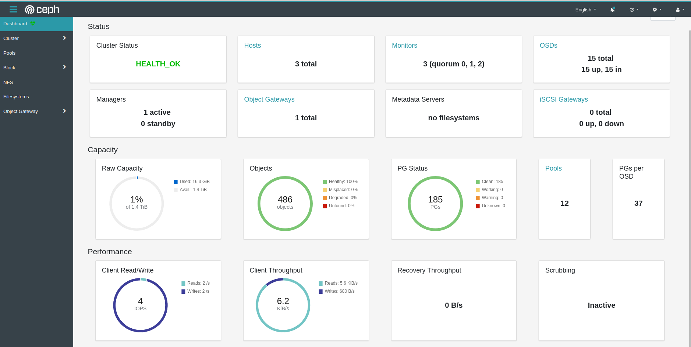

# CEPH INSTALLATION METHODS

## Ceph - a scalable distributed object, block, and file storage system platform

### Ceph version list
Ceph version list - [https://en.wikipedia.org/wiki/Ceph_(software)](https://en.wikipedia.org/wiki/Ceph_(software))

### Ceph packages
Ceph packages - [http://us-west.ceph.com/](http://us-west.ceph.com/) | [https://download.ceph.com/](https://download.ceph.com/) | [https://mirrors.tuna.tsinghua.edu.cn/](https://mirrors.tuna.tsinghua.edu.cn/)

### Ceph Calculator
Ceph PGs per Pool Calculator - [https://ceph.io/pgcalc/](https://ceph.io/pgcalc/)

---
### Installation Methods  

Ceph Manual Installation - [deploy a cluster manually](https://docs.ceph.com/en/latest/install/index_manual/#deploy-a-cluster-manually)  

Ceph Deploy - [ceph-deploy installation](https://docs.ceph.com/en/nautilus/install/install-ceph-deploy/) | [ceph git project](https://github.com/ceph/ceph)  

Cephadm - [cephadm master(branch)](https://github.com/ceph/ceph/blob/master/src/cephadm/cephadm) | [cephadm pasific(branch)](https://raw.githubusercontent.com/ceph/ceph/pacific/src/cephadm/cephadm) | [cephadm octopus(branch)](https://raw.githubusercontent.com/ceph/ceph/octopus/src/cephadm/cephadm) | [ceph container git](https://github.com/ceph/ceph-container)  

Ceph Ansible - [ceph-ansible git project](https://github.com/ceph/ceph-ansible)  

Ceph GUI - [cockpit-ceph-installer redhat git project](https://github.com/red-hat-storage/cockpit-ceph-installer)  

Ceph NANO - [cn - ceph nano tool](https://github.com/ceph/cn) | [ceph container git project](https://github.com/ceph/ceph-container)  

Rook Ceph(Kubernetes) - [ceph install with cloud-native storage orchestrator](https://rook.io/docs/rook/v1.5/ceph-quickstart.html)  

Kubernetes + Helm - [ceph install with kube-helm](https://docs.ceph.com/en/nautilus/start/kube-helm/)  

Ceph Compose - [ceph install with docker-compose](https://github.com/fatlan/Ceph-Docker-Compose)
